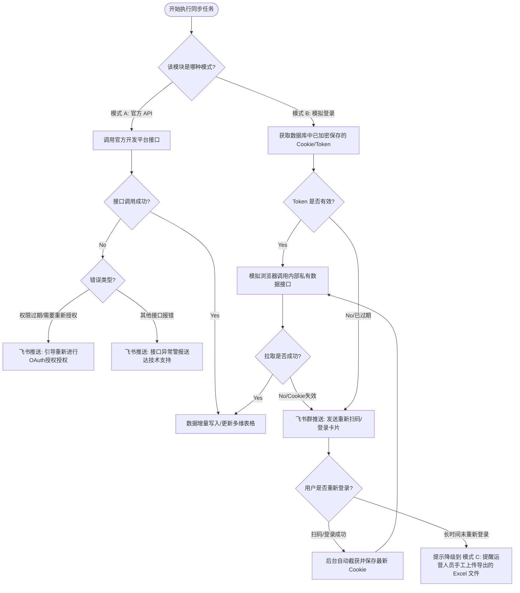

# 飞书多维表格数据源连接器 - 功能对接与接口可行性分析 (.md)

# 演示html地址
https://gemini.google.com/share/8313ff4f3d9f

本文件作为多维表格数据源连接器开发人员的**需求实现核对清单（Checklist）**，详细映射了您在多维表格中提出的 26 项具体平台页面/模块的接口对接可行性。根据技术架构规范，**每一个数据源平台插件均在逻辑上完整支持“模式 A (官方 API)”与“模式 B (网页模拟登录捕获)”的双通道模型**，为开发团队提供统一的实现标准与降级方案。

---

## 🛠 一、 方案执行指导原则 (双通道通用模型与动态菜单发现)

每个对接平台均支持以下两种数据获取模式，开发人员可根据商户的实际资质在配置弹窗中随时进行切换：

### 🟢 模式 A：官方 API 接口连接模式
*   **实现机制**：直接调用第三方平台针对开发者或商家公开的标准化 OpenAPI，通过 AppKey/AppSecret 或跳转 OAuth 进行授权绑定。
*   **适用场景**：商户拥有官方开放平台开发者资质，且该模块有公开的 API 接口支持（如聚水潭 ERP 官方 API、抖店账单接口、千川投放接口等）。
*   **开发说明**：遵循官方 API 限制进行分页处理与并发控制。

### 🔵 模式 B：模拟登录与 Token 捕获连接模式 (优先动态菜单发现)
*   **实现机制**：在 H5 配置弹窗中为用户提供内嵌安全登录容器（网页扫码/验证码登录），后台拦截并捕获该会话的 Cookie/Token。
*   **适用场景**：商户无官方开放平台 ISV 资质，或官方未开放公共 API 接口的受限看板（如罗盘核心指标、小红书蒲公英数据、千牛非API直联商家后台等）。
*   **🌟 动态菜单导航发现机制 (Prioritized Menu Fetching)**：
    为了规避第三方平台页面频繁升级改版导致的接口路径失效风险，在模式 B 下执行数据同步时，后端**严禁直接硬编码**数据查询 Endpoint。必须遵循以下执行序：
    1. **获取凭证**：获取已加密存储的 Cookie。
    2. **优先获取工作台菜单格式 (Menu Schema Fetching)**：首先请求该平台控制台主框架的“导航菜单/功能路由列表”接口（如罗盘菜单树 `GET /compass/api/v1/menu`，千帆菜单树 `GET /ark/api/v1/menu` 或千牛工作台菜单接口），获取当前平台最新的功能导航结构与路由映射。
    3. **动态请求数据接口 (Dynamic Ingestion)**：根据解析出来的菜单节点和最新 Endpoint，结合用户请求的内容（所选模块、时间范围、商户ID），动态装配参数并发起私有接口数据调用。
*   **降级方案 (Mode C - 备用)**：如果在特定时期（如平台登录风控极严）导致 Token 频繁被踢，系统应在 H5 配置弹窗页面保留“Excel 拖入解析上传”的备用入口，支持读取罗盘/蒲公英导出的表格数据直接同步。

---

## 二、 26项多维表格对接清单 (开发者快速索引)

为方便开发人员快速评估工作量，以下是精简的汇总索引表。具体各接口的入参、抓取细节与抓取路径请参阅下方的 **“三、 各平台对接开发详解”**。

| 序号 | 对接平台 | 所在页面 / 需求模块 | 实现模式 | 接口状态 | 核心接口 / 抓取路径 |
| :---: | :--- | :--- | :---: | :---: | :--- |
| **1** | 阿里妈妈-万象台 | 推广流水 / 账户明细 | **A / B** | 🟡 双模式 | TOP 营销接口 或 万象台资金后台 API / 菜单发现模拟 |
| **2** | 抖音 | 资金板块 / 余额明细 | **A / B** | 🟢 双模式 | 抖店 API: `order.getShopAccountItem` / 抖店后台资金流水菜单模拟 |
| **3** | 抖音 | 资金板块 / 待结算资金 | **A / B** | 🟢 双模式 | 抖店 API: `order.getSettleBillDetailV3` / 抖店后台待结算菜单模拟 |
| **4** | 抖音 | 推广板块 / 推广板块 | **A / B** | 🟢 双模式 | 巨量引擎 API: 推广对账接口 / 巨量后台对账菜单模拟 |
| **5** | 抖音 | 巨量千川-数据 / 素材数据 | **A / B** | 🟢 双模式 | 巨量引擎 API: `report/custom/get` / 千川素材分析菜单模拟 |
| **6** | 抖音 | 巨量千川-数据 / 全域数据明细 | **A / B** | 🟢 双模式 | 巨量引擎 API: 千川报表接口 / 千川全域分析菜单模拟 |
| **7** | 抖音 | 电商罗盘 / 成交概览与载体构成 | **A / B** | 🔴 双模式 | 罗盘接口 / 罗盘菜单发现: `/compass/api/v1/trade/overview` |
| **8** | 抖音 | 电商罗盘 / 商品详情核心数据 | **A / B** | 🔴 双模式 | 罗盘接口 / 罗盘菜单发现: `/compass/api/v1/product/detail` |
| **9** | 抖音 | 巨量千川 / 商品推广汇总与单品 | **A / B** | 🟢 双模式 | 巨量千川 API: 商品报表接口 / 千川推广菜单模拟 |
| **10** | 京麦 | 资金板块 / 城销售明细表 | **A / B** | 🟢 双模式 | 京东 API: 结算单/账单接口 / 京麦资金对账菜单模拟 |
| **11** | 聚水潭 | 发货报表 | **A / B** | 🟢 双模式 | 聚水潭 API: 发货单查询 / 聚水潭后台发货报表菜单模拟 |
| **12** | 聚水潭 | 库存 - 销售出库单 | **A / B** | 🟢 双模式 | 聚水潭 API: `salesout.query` / 聚水潭销售出库菜单模拟 |
| **13** | 聚水潭 | 退货报表 | **A / B** | 🟢 双模式 | 聚水潭 API: 售后单查询 / 聚水潭售后退货菜单模拟 |
| **14** | 千牛工作台 | 微信支付 / 聚合算收支明细 | **A / B** | 🟢 双模式 | 微信支付 API: 账单下载 / 千牛微信收支明细菜单模拟 |
| **15** | 千牛工作台 | 支付宝支付 / 对账资金账单 | **A / B** | 🟢 双模式 | 支付宝 API: `dataservice.bill.downloadurl` / 千牛支付宝账单菜单模拟 |
| **16** | 小红书 | 蒲公英 / 投后数据-笔记发布时间 | **A / B** | 🔴 双模式 | 蒲公英接口 / 蒲公英菜单发现: `/pgy/api/v1/note/list` |
| **17** | 小红书 | 蒲公英 / 去投放-商业内容管理 | **A / B** | 🔴 双模式 | 蒲公英接口 / 蒲公英菜单发现: `/pgy/api/v1/order/manage` |
| **18** | 小红书 | 乘风 / 标准投放-账户分日明细 | **A / B** | 🟢 双模式 | 小红书营销 API: 账户报表接口 / 乘风账户报表菜单模拟 |
| **19** | 小红书 | 乘风 / 标准投放-计划每月汇总 | **A / B** | 🟢 双模式 | 小红书营销 API: 计划报表接口 / 乘风计划报表菜单模拟 |
| **20** | 小红书 | 聚光 / 标准投-基础报表-计划 | **A / B** | 🟢 双模式 | 小红书营销 API: 聚光计划报表 / 聚光菜单发现模拟 |
| **21** | 小红书 | 聚光 / 标准投-账户报表-计划 | **A / B** | 🟢 双模式 | 小红书营销 API: 聚光账户报表 / 聚光菜单发现模拟 |
| **22** | 小红书 | 资金板块 / 余额明细 | **A / B** | 🟡 双模式 | 千帆接口: `/ark/api/v1/finance/balance` / 千帆财务菜单模拟 |
| **23** | 小红书 | 资金板块 / 待结算金额 | **A / B** | 🟡 双模式 | 千帆接口: `/ark/api/v1/finance/settle` / 千帆财务菜单模拟 |
| **24** | 小红书 | 千帆数据 / 经营概览与载体构成 | **A / B** | 🔴 双模式 | 千帆接口 / 千帆菜单发现: `/ark/api/v1/dashboard/overview` |
| **25** | 小红书 | 千帆数据 / 商品详情页核心数据 | **A / B** | 🔴 双模式 | 千帆接口 / 千帆菜单发现: `/ark/api/v1/dashboard/product` |
| **26** | 小红书 | 乘风 / 标准投商品数据明细 | **A / B** | 🟢 双模式 | 小红书营销 API: 商品维度报表 / 乘风推广菜单模拟 |

---

## 💻 三、 各平台对接开发详解 (Developer Specification)

### 1. 抖音生态对接模块 (Doudian / Ocean Engine / Compass)

#### 🟢 官方 API 接入项 (2、3、4、5、6、9)
*   **【抖店资金对账 (序号2, 3)】**：
    *   **接口文档**：[抖店开放平台](https://op.jinritemai.com/)
    *   **开发所需接口参数**：`shop_id` (店铺ID，必须), `start_time` / `end_time` (对账时间段) —— **官方 API 标准参数**。
    *   **实现方法**：调用账单服务：
        *   `余额明细`：通过接口 `order.getShopAccountItem` 拉取流水。
        *   `待结算货款`：调用 `order.getSettleBillDetailV3` 根据订单的预估结算状态进行筛选统计。
*   **【巨量广告与千川投放 (序号4, 5, 6, 9)】**：
    *   **接口文档**：[巨量引擎 Marketing API](https://open.oceanengine.com/)
    *   **开发所需接口参数**：`advertiser_id` (广告主ID，必须), `time_range` (起止时间段，近30天), `marketing_goal` (营销目标，短视频带货/直播) —— **官方 API 标准参数**。
    *   **实现方法**：
        *   `千川素材数据`：使用通用自定义报表接口，传参 `data_topic = MATERIAL_DATA`。
        *   `全域与单品数据`：调取 `/open_api/v1.0/qianchuan/report/*` 系列接口，按天（T-1）拉取展现、消耗、点击、转化及 ROI。
        *   **开发提示**：接口支持按 `advertiser_id` 批量获取，建议后台统一采用异步队列分批写入。

#### 🔴 模拟登录凭证捕获项 (7、8)
*   **【电商罗盘数据 (序号7, 8)】**：
    *   **目标页面**：`https://compass.jinritemai.com/` (交易概览、载体构成、商品详情)
    *   **开发所需接口参数**：`shop_id` (店铺ID，必须), `date_range` (时间范围) —— **网页私有接口模拟参数**。
    *   **开发路径**：
        1. 拦截捕获登录会话后，后台发送模拟请求至罗盘私有数据端点：
           *   成交概览：`GET /compass/api/v1/trade/overview` (传入 `shop_id` 和日期参数)
           *   商品核心：`GET /compass/api/v1/product/detail` (传入 `shop_id` 和商品编码)
        2. **Header 核心参数**：必须携带拦截到的 `Cookie` 与 `anti-spam` 签名 Token。
        3. **格式化映射**：解析响应中 `data.list` 里的成交、曝光、转化率字段，扁平化后写入多维表格。

---

### 2. 小红书生态对接模块 (Xiaohongshu Pgy / Ad / Qianfan)

#### 🟢 官方 API 接入项 (18、19、20、21、26)
*   **【聚光/乘风效果广告报表 (序号18, 19, 20, 21, 26)】**：
    *   **接口文档**：[小红书商业开放平台](https://ad-market.xiaohongshu.com/)
    *   **开发所需接口参数**：`account_id` (广告账号ID，必须), `start_date` / `end_date` (计划/账户维度起止时间段) —— **官方 API 标准参数**。
    *   **实现方法**：
        *   调用报表接口获取账户分日明细、计划月汇总及商品数据。
        *   **开发提示**：小红书 API 限制了单次拉取的计划数量上限，需在底层代码中自动做 `chunk` 分组请求合并。

#### 🔴 模拟登录凭证捕获项 (16、17、22、23、24、25)
*   **【蒲公英达人投放 (序号16, 17)】**：
    *   **目标页面**：`https://pgy.xiaohongshu.com/` (数据报告与商业管理)
    *   **开发所需接口参数**：`brand_id` (品牌ID，必须), `date_range` (过滤起止时间) —— **网页私有接口模拟参数**。
    *   **接口路径**：`/pgy/api/v1/note/list` 和 `/pgy/api/v1/order/manage`
    *   **开发说明**：登录后后台捕获 `pgy_session`。使用此 Cookie 模拟轮询获取合作笔记的发布时间、最新阅读数、点赞数和订单进度。
*   **【千帆商家后台数据 (序号22, 23, 24, 25)】**：
    *   **目标页面**：`https://ark.xiaohongshu.com/` (余额、在途、经营概览与商品核心)
    *   **开发所需接口参数**：`shop_id` (店铺ID，必须), `date_range` (时间周期) —— **网页私有接口模拟参数**。
    *   **接口路径**：
        *   对账明细：`/ark/api/v1/finance/balance`（或后台私有对账接口）
        *   经营大盘：`/ark/api/v1/dashboard/overview`
    *   **开发说明**：若商家拥有千帆官方 API 权限，优先通过官方 API（模式 A）拉取数据；**若商家权限受限（受限存在），则引导用户进行模拟登录（模式 B）**，拦截捕获千帆 `session` 凭证，并在后台模拟请求私有接口获取资金、全店成交与单品数据。

---

### 3. ERP 与其他平台对接模块 (Jushuitan / Alimama / Jingmai / Qianniu)

#### 🟢🟢 通用 A / B 双通道接入项 (10、11、12、13、14、15、1)

*   **【聚水潭 ERP (序号11, 12, 13)】**：
    *   **实现方法**：
        *   **模式 A (官方 API)**：直接对接聚水潭开放平台，核心接口为 `/open/delivery/query` (发货)、`/open/salesout/query` (出库)、`/open/refund/query` (退货)。传入参数：`sync_type` (单据类型) 与 `date_offset` (回溯偏移)。
        *   **模式 B (模拟登录)**：若商家无开放平台 API 资质，引导用户在 WebView 容器中登录聚水潭管理后台 (`https://partner.jushuitan.com/`)。成功后捕获 Cookie。
        *   **🌟 菜单格式优先拉取**：后端发起数据请求前，首先调用 `/api/web/sys/menu` 获取系统菜单树，依据菜单结构映射出真实的报表统计 API 数据端点，拼装入参动态获取发货、出库与退货的列表数据。
*   **【千牛对账账单 (序号14, 15)】**：
    *   **实现方法**：
        *   **模式 A (官方 API)**：直接使用微信支付商户 API 和支付宝开放平台的 `alipay.data.dataservice.bill.downloadurl.query`，拉取对账单。
        *   **模式 B (模拟登录)**：引导用户登录千牛工作台网页版 (`https://work.taobao.com/`)，拦截捕获 Cookie。
        *   **🌟 菜单格式优先拉取**：优先请求 `/qn/api/menu` 获取工作台导航，解析出支付宝账单/资金明细页面所在的私有端点，模拟请求进行数据抓取落地。
*   **【京麦销售明细 (序号10)】**：
    *   **实现方法**：
        *   **模式 A (官方 API)**：调用京东开放平台结算 API 获取已收款明细，传入 `merchant_id` 和 `bill_period`。
        *   **模式 B (模拟登录)**：引导用户登录京东商家后台 (`https://shop.jd.com/`)，拦截 Cookie。
        *   **🌟 菜单格式优先拉取**：优先请求 `/merchant/menu/list`，定位销售结算明细报表模块，解析数据 URL 后模拟请求并写入。
*   **【阿里妈妈-万象台 (序号1)】**：
    *   **实现方法**：
        *   **模式 A (官方 API)**：首选对接淘宝开放平台营销 API。
        *   **模式 B (模拟登录)**：引导用户登录阿里妈妈万象台控制台，拦截 Cookie。
        *   **🌟 菜单格式优先拉取**：优先请求万象台工作台的路由菜单 `/universal/api/menu`，依据返回的动态节点获取万象台推广计划与流水资金账单的数据 API 路径，再请求具体数据。

## 🔄 三、 开发对接时的具体异常与技术降级流程

若开发者在编写连接器逻辑或同步过程中遇到接口不存在/权限失效，应遵循以下逻辑进行降级处理：

