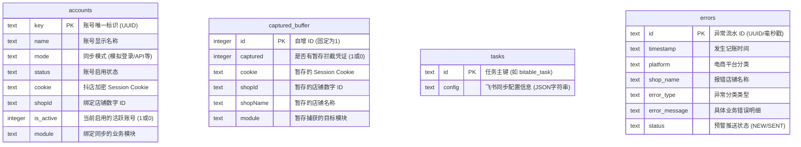

# 飞书多维表格数据源连接器 — 数据库以及功能分布说明书

本说明书详细阐述了连接器系统所使用数据库的文件位置、Schema 设计、表核心字段以及业务功能模块在数据表层面的流向图，方便后续对接“插件管理后台”或进行其他系统集成。

---

## 1. 数据库基础信息

* **数据库类型**：SQLite 3 (轻量级嵌入式单文件数据库)
* **存储位置**：`data-sync-be-demo/data/connector.db`
* **引擎特点**：零配置、零维护，天然支持单文件拷贝。后续管理后台可直接挂载读取该文件，或通过 Node 进程进行多进程共享读写。

---

## 2. 数据库 Schema 与表结构定义

目前数据库主要包含 4 张核心业务表以及 1 张全局系统配置表（待拓展预留）：



### 2.1 账号表 (`accounts`)
* **作用**：存储所有已绑定、授权的抖店商家配置。
* **建表语句**：
  ```sql
  CREATE TABLE IF NOT EXISTS accounts (
    key TEXT PRIMARY KEY,
    name TEXT,
    mode TEXT,
    status TEXT,
    cookie TEXT,
    shopId TEXT,
    is_active INTEGER DEFAULT 0,
    module TEXT
  );
  ```
* **核心字段说明**：
  * `key`：主键，前端生成的 UUID。
  * `cookie`：最核心的授权 Session 字符串。
  * `is_active`：活跃标示。当有多个账号时，仅有一个账号的 `is_active` 为 `1`。每次同步时，后端都去取 `is_active = 1` 的 Cookie 发起请求。
  * `module`：关联同步模块名（如 `account_center`）。

### 2.2 捕获缓冲区表 (`captured_buffer`)
* **作用**：作为“书签一键捕获”上报时的单一数据缓冲区。
* **建表语句**：
  ```sql
  CREATE TABLE IF NOT EXISTS captured_buffer (
    id INTEGER PRIMARY KEY AUTOINCREMENT,
    captured INTEGER,
    cookie TEXT,
    shopId TEXT,
    shopName TEXT,
    module TEXT
  );
  ```
* **核心字段说明**：
  * 该表永远只包含 `id = 1` 的一条记录。
  * 浏览器书签插件检测到登录时，调用 POST 接口将最新 Cookie 写入此处，并将 `captured` 设为 `1`。
  * 前端 H5 弹窗轮询此记录，发现 `captured == 1` 时读取，并在账号列表弹窗中引导用户保存。保存后，清空该缓冲区（`captured` 重置为 `0`）。

### 2.3 任务配置表 (`tasks`)
* **作用**：保存飞书多维表格数据源当前的运行配置（同步范围、字段映射等）。
* **建表语句**：
  ```sql
  CREATE TABLE IF NOT EXISTS tasks (
    id TEXT PRIMARY KEY,
    config TEXT
  );
  ```
* **核心字段说明**：
  * `id`：默认值为 `bitable_task`。
  * `config`：飞书发来的整个配置 JSON 字符串。包含字段映射关系、商户 UID、同步天数、支付通道等信息。在触发真实的增量同步时，后端会从中解析出高级筛选参数。

### 2.4 故障预警异常表 (`errors`)
* **作用**：记录同步中的故障异常。与飞书多维表格端对应的“故障记录表”列定义保持一致。
* **建表语句**：
  ```sql
  CREATE TABLE IF NOT EXISTS errors (
    id TEXT PRIMARY KEY,
    timestamp TEXT,
    platform TEXT,
    shop_name TEXT,
    error_type TEXT,
    error_message TEXT,
    status TEXT
  );
  ```
* **核心字段说明**：
  * `error_type`：错误归类，如 `凭证失效(Cookie过期)` 或 `接口500报错`。
  * `status`：报警标记。若启用飞书机器人推送，该字段用于标识此报错是否已成功报警，实现报警频控逻辑。

### 2.5 全局系统配置表 (`system_configs` - 预留拓展)
* **作用**：存储系统级全局常量（如客服二维码、飞书加好友链接、飞书机器人 Webhook URL 等）。
* **建表语句**：
  ```sql
  CREATE TABLE IF NOT EXISTS system_configs (
    key TEXT PRIMARY KEY,
    value TEXT,
    description TEXT
  );
  ```

---

## 3. 系统功能与数据流向分布图

连接器系统的数据在“前端界面 - 书签采集 - 后端数据库 - 飞书接口”之间做如下流向分布：

```
1. 账号绑定捕获流：
   [抖店后台] ──(书签插件拦截)──> [POST: capture-login] ──> 写入 SQLite [captured_buffer]
                                                                  │
   [前端 App.tsx] <──(轮询: capture-status)────────────────────────┘
         │
         └──(保存/启用账号)──> [POST: accounts/add] ──> 写入 SQLite [accounts] (标记 is_active=1)

2. 飞书同步数据流：
   [飞书多维表格引擎] ──(POST: /api/records)──> [后端: table_records.js]
                                                      │
         ┌────────────────────────────────────────────┴───────────┐
         ▼ (读取 active 账号 Cookie 及 tasks 配置)                    ▼ (异常拦截与预警推送)
   读取 SQLite [accounts] & [tasks]                         若发生 Error (如 Cookie 过期)
         │                                                        │
         ▼ (发起 Form 表单请求)                                    ├─> 写入 SQLite [errors]
   请求抖音私有接口 queryAccountFlows                             │
         │                                                        └─> (频控防炸群检测) ──> 飞书自建应用推送给王某
         ▼ (分转元单位换算 & 9大字段映射)
   清洗并转换数据格式 ──> 响应输出给飞书 bitable 引擎
```

---

## 4. 后续插件管理后台对接设计方案

未来若开发“插件管理后台”或整合至第三方系统，对接连接器的具体实现方案建议如下：

1. **共享 SQLite 实例 (最轻量)**：
   管理后台与连接器部署在同一台宝塔服务器上，直接配置管理后台的 ORM 引擎连接本地 `connector.db`。直接对 `accounts` 进行只读查询（监控在线商家状态），对 `errors` 进行读取统计（分析连接器健康大屏）。
2. **REST API 网关 (推荐隔离方案)**：
   连接器后端在 `index.js` 中开发安全可控的管理 API，提供认证 Key 访问：
   * `GET /api/v1/admin/accounts`：查询所有商家 Cookie 与状态。
   * `POST /api/v1/admin/configs`：动态更新全局配置（如追加/更换客服飞书邀请链接）。
   * `GET /api/v1/admin/errors`：读取最近报错记录。
3. **数据冗余投递**：
   在连接器完成抖音流水的拉取、清洗并回传给飞书多维表格的同时，在后端代码中增加一个 Hooks 管道，将清洗后的元数据一并异步推送至外部系统的接收 API（如 `http://admin-api.com/v1/receive-flows`），实现数据的两地自动同步存储。
